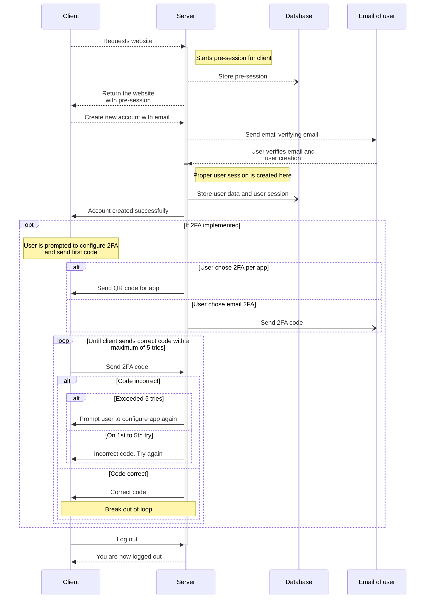
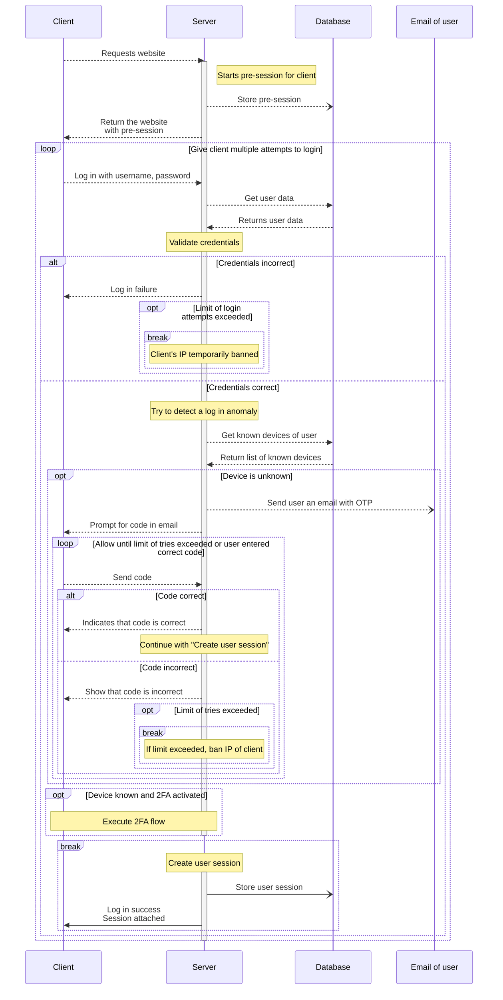
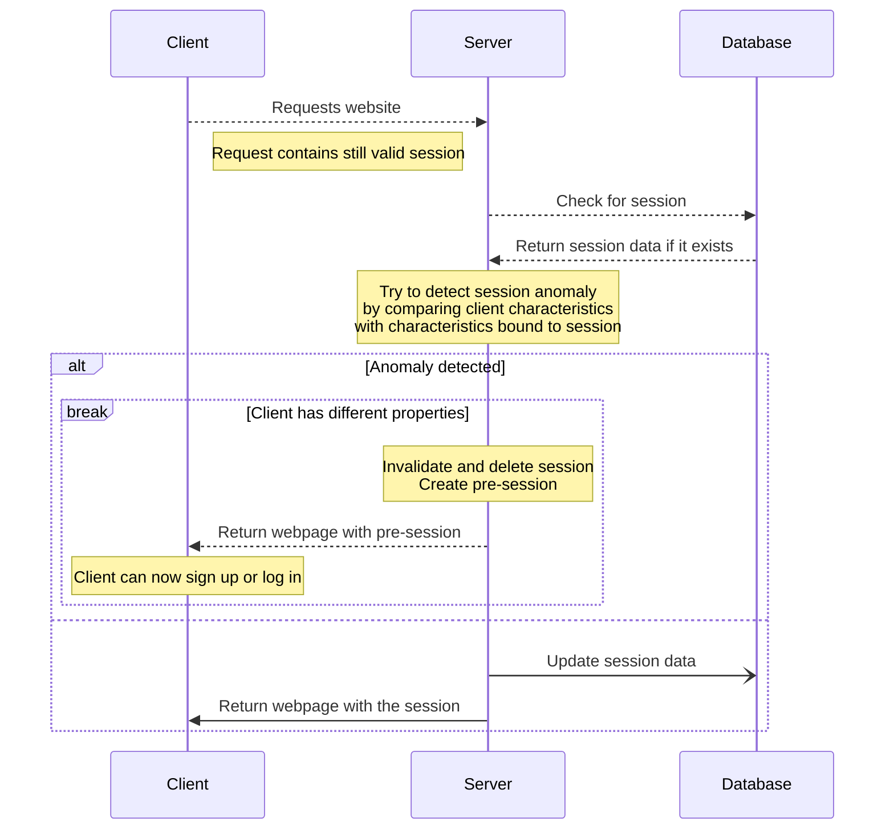

# Authentication
:::warning
The following document is not yet implemented.
:::
## Overview
Most of the website's features and service require authentication of the client because the server has to associate a user with the client.
A user can authenticate with a username/email address and a password. In the future, we plan to add other authentication schemes.
Authentication requests are strictly monitored to prevent account takeover and similarly malicious activities.
A detailed explanation can be found under [Account Security](./account_security).

When a user successfully authenticates they receive a session token. This token has to be sent with every request to prove their identity.
A session has an expiration, is associated with client data, and can be revoked if requested by the user or if the server detected malicious activity.
How this is implemented is explained in [Session Management](./session_management).

## Account creation
Any client can created a new user account with a username, email address and password.
We impose some constraints and checks on these credentials before the account is actually created.
Any violation will be shown and explained to the user.

In the following subsection we will explain all checks and constraints.
### Credentials Constraints
 
#### Username
Within the website, users are always referred to by their username of email address, and the internally used user ID is never expose to the user. Therefore, we require that the username is unique.

#### Email address
The email address has to be valid, exist, and belong to the user. Additionally we only allow one account per email address.

This is to counter adversaries executing a *Denial-of-Service* attack by creating many user accounts.
While it increases the difficulty of such an attack, an attacker with enough resources could create many temporary email accounts to bypass this protection.
As an additionally protection we could use a list of known temporary email providers and check if an email address matches any domain, but if the adversary uses a custom domain and not a known service, there is not much we can do.
For now, we will not implement any additional protection against known temporary email services.

We will check if the email address is real and if the user has access to it by sending an email to that address, prompting the user confirm their email address. This process is explained in [Email address confirmation](#email-address-confirmation).

Validity of an email address is implemented with syntax check in the frontend based on *regular expressions*.

#### Password
We require a password to have a minimum length of **8 characters**. We also impose a maximum length, but set it high enough, such that it shouldn't be a problem for any honest user.

We additionally require the user to enter the password two times. This is to avoid the situation in which a user may have mistyped their password and cannot access the account they created two seconds ago.

### Process
The following short sections will provide a detailed description of how the sign-up and account creation process works.

The process starts with a user who is not authenticated and has no session ID stored on the client (this is also the case when the cookie used to store the session ID has expired).

#### Sending the credentials
The user is immediately redirected to the sign-up/login screen.
The user wishes to create a new account and clicks on "Sign Up".
The website shows a form in which the user can enter the username, email, and password to use for their new account.
The form requires the user to enter their password two types in two different text fields.
Before the user is able to sign up, it is verifies that the input fulfills the above described [Credential constraints](#credentials-constraints).
Not all constraints can be verified on the client, for example, it is not possible to check if the username is valid.

Next, the user can create a sign-up request.

#### Server-side validation
When the server receives a sign-up request, it verifies all constraints and rejects the request if it violates any constraints.
If all constraints, except confirmation of the email address, are fulfilled, the server sends the email address confirmation, create a temporary account, and sends a response to the client that the request has successfully been accepted.
The account is created as a *pending user* and not as a fully accessible user.
Only when the email address is confirmed is the account permanently created and the user can use their credentials to login.

Additionally, the authentication process is protected with a **CSRF Token**.

#### Email address confirmation
After the server accepts the sign-up request and sent an email address confirmation email to the email address the user specified, the user is navigated to a form explaining that they have to confirm their email address by entering a **One-Time-Password (OTP)**.
The required code is sent in that email address confirmation email, the code is associated with the pending user account and is unique.

Here, we have to protect against several exploits.

First, a bad actor could try to brute force the code. Therefore, we have to limit the amount of tries a user can enter an OTP. Here, the questions remains of how to handle when a user exceeds this limit.
We could delete the account, require the user to request another email address confirmation address, or temporarily prevent the user from trying again.
Both options provide the same protection, stopping the bad actor to brute force the same OTP but not stopping them entirely from ever trying to create that account, which would not be desirable.
If a non-malicious user happens to exceed the limit, we don't want to stop them from creating an account.
Thus, the second options is chosen because it provides a better user experience, compared to the first option.
A user doesn't have to enter all their account data again and can simply request another email.
Additionally, with this method we address temporary email server outages or email delivery problems.
If a user doesn't receive the email address confirmation email, they should be able to request a new one.
Generally important here is that if a new email address confirmation is requested, a new OTP has to be created and associated with the pending user account, and the old one has to be made invalid.
Otherwise, a bad actor might bypass our brute-force protections.

Secondly, a bad actor could create pending user accounts for many email addresses. If we require that only one pending user account can be created for each email address, this could block the actual owner of that email address from creating an account.
Combating this, we can simply allow that there can be multiple pending user accounts for the same email address.
Additionally, if a pending user account is confirmed via the email address confirmation email, other pending user accounts have to be deleted.

For improved user experience, we could hide the OTP and only send the user an email address confirmation email where they have to a click a link. The OTP would be in the link presented in the email and clicking on it (opening up the website with that link) would confirm the email address.
While this might improve user experience, I see some problems in properly protecting this system, especially from *CSRF attacks*. Additionally, when trying to create an account on one device and opening the link on another one, would require automatic synchronization or manual reloading of the website. Thus, providing a worse user experience in other cases. Therefore, we will not take this approach but may reconsider it in the future.

#### Creating the account
Creating the user account is relatively straight forward.
When the user confirms their email address the server creates a new permanent *user account* based on the data stored in the users *pending user account*.
As a response to the email confirmation the server issues a session (more information [here](./session_management.md))

## Login
Login is slightly more simple the sign-up because much of the account information verification has already happened, like email address confirmation.
However, there are some other protections we have to consider.

In the following we will explain the login process, how it works, and what protections are in place.

### Process
We assume that the user has no valid session but has created an account.
When a user wants to login they can enter their credentials (username/email address and password) in the login form and click the login button.
The browser will send a request to the server.
The server will check if the username/email address password pair matches the pair stored in the database. If so, it will accept the login and issue the user a session associated with their account.

While the process itself is simple, there are protections in placed not mentioned here.

### Protections
There are several types of threats to such a system.
The following sections each will introduce the threat and what protections we implemented against them.

#### Brute-force
A simple way of an attacker to gain access to a user's account is to try all combination of passwords for a known existing user name.
If no protection is in place, and the password is guessable or short enough, this attack will work after many tries.

To make this attack infeasible, we limit the amount of tries a client has to enter the password in a given time interval and temporarily ban the client's IP address if it exceeds it.
With this, the time required to guess the password becomes very long and such, infeasible to use.

It is important that our protection blocks malicious tries but not punish the user for remembering their password wrong.
Therefore, the amount of tries (*lockout threshold*), the time duration in which we check tries (*observation window*), and the ban duration(*lockout duration*) has to accommodate for this.

 - **Observation window**: 15 minutes
 - **Lockout threshold**: 10 tries
 - **Lockout duration**: 1 hour

:::info
Recommendations are, that rather than blocking the client's IP, the the lockout should be associated to the user.
While this is more secure because it protects against the attacker using multiple IP addresses simultaneously, it could be used to perform a DoS attack, essentially locking out all users.
To prevent this, additional features like password recovery for a locked out account, are required.
Because no such feature exists and is not planned for the next release, due to developing costs, we will not choose this approach but we will reconsider it in the future.
:::

#### Login anomalies
Detecting login anomalies is very important to secure user accounts even if credentials or sessions get leaked.

Detecting anomalies is done by storing common characteristic of a user, like their IP or location, and verifying if a client, logging in as that user, exhibits the same characteristics.

Our system for detecting login anomalies functions similarly to the one we use to detect session anomalies.
It is explained in [here](./session_management.md#session-hijacking-protection).
There are some key difference in what is verified and what actions the system will take once an anomaly is detected.

To summarize, the system for checking session anomalies is much more strict because it can assume that the session will not move to another device, therefore changes of the User-Agent will most likely not happen, and a session can not be additionally protected with *2FA* like a login.

##### Stored client information
Because it is likely a user will access the website closely before or after traveling by car we can expect that a user may login from several IP addresses.
Thus, checking the client's IP address might lead to a high percentage of false positives.
This is not desired and we will verify the client's *User-Agent* instead.

Each time the user successfully logs in and when the account is created, the client's User-Agent is stored associated with the user.
When the user logs in, it is checked if the user has ever logged in with that User-Agent.
If yes, the login is accepted.
If no, it is considered an anomaly and the server will react as follows.

##### Reacting to an anomaly
The server reacts to an anomaly by rejecting the login and requiring the user to confirm that they are the actual owner of the account.
This is achieved with the same system used for the email address confirmation email.

The website shows the user a message telling them that they have never logged in on that device before and that they have to confirm their login.
The server sends an email with an *OTP*, which the user has to enter on the website, within in limited amount of tries.
After the user successfully enters the OTP the login is successful.
Consequently, the new User-Agent is stored for the user and will be checked on subsequent login attempts.

#### 2FA
Two-factor authentication is an effective way to protect accounts against compromised user credentials.

This security feature is planned, but in a future release, due to limited time.

## Future plans
In the future we hope to support two-factor authentication with an email address, an 2FA app and [WebAuthn](https://webauthn.guide/).

## Authentication sequence diagrams
The following sequence diagrams show a general overview of the sign-up and login authentication flow.
Dotted lines represent requests while the client is not authenticated and full lines represent requests while the client is authenticated.

The [Sign-up authentication flow](#sign-up-authentication-flow) and [Log in authentication flow](#log-in-authentication-flow) graphs assume that the user has not valid session token stored on the client.
The graph [Log in via stored session](#log-in-via-stored-session) will address this case.

:::info
The parts explaining the *2FA* flow are a draft version and subject to change.
:::
### Sign-up authentication flow

### Log in authentication flow

### Log in via stored session

## Entire authentication process
The following graph shows the entire authentication process from the moment the user visits the webpage to the moment the user is logged in or their log in is rejected and the clients knows the authentication state.

```mermaid
flowchart TD
    Start(User requests website) --> check_initial_session

    check_initial_session{"Server checks if client
    has valid session"}

    check_initial_session -- Valid session --> check_session_exists
    check_initial_session -- No session --> create_pre_session
    check_initial_session -- Pre_session --> get_pre_session_csrf_token

    check_session_exists{"Server checks if
    session exists"}
    check_session_exists -- Exists --> load_session
    check_session_exists -- Non-existing --> create_pre_session

    load_session(Server loads session data)
    load_session --> check_session_expired

    check_session_expired{"Server checks if
    session has expired"}
    check_session_expired -- Not expired --> detect_session_anomaly
    check_session_expired -- "Expired
    Delete session" --> create_pre_session

    detect_session_anomaly{"Check if client
    characteristics bound
    to session match
    requesting client"}
    detect_session_anomaly -- No anomaly --> get_csrf_token
    detect_session_anomaly -- "Anomaly
    Delete session" --> create_pre_session

    get_csrf_token(Client gets csrf token of their session)
    get_csrf_token -- Auth check will succeed --> check_auth

    create_pre_session("Server creates pre-session and csrf token,
    attaches to response")
    create_pre_session --> get_pre_session_csrf_token

    get_pre_session_csrf_token("Client gets csrf token
    of it's pre-session")
    get_pre_session_csrf_token -- Auth check will fail --> check_auth

    check_auth{"Client checks
    if it's logged in"}
    check_auth -- Client has session --> user_logged_in
    check_auth -- Client has pre-session --> user_not_logged_in

    user_logged_in(User is logged in)
    user_logged_in --> stop_logged_in

    stop_logged_in{{"Stop of authentication flow"}}

    user_not_logged_in(User is not logged int)
    user_not_logged_in --> user_authenticates

    user_authenticates{"User wants to
    authenticate"}
    user_authenticates --> sign_up
    user_authenticates --> log_in

    sign_up("User wants to create a new account.
    Client sends sign-up request")
    sign_up --> check_username_and_password

    check_username_and_password{"Server checks if username
    or email already used"}
    check_username_and_password -- Either one already used --> sign_up
    check_username_and_password -- Neither is used --> create_pending_user

    create_pending_user(Server creates pending user account)
    create_pending_user --> send_confirmation_email

    send_confirmation_email("Server sends OTP
    to email address
    of user")
    send_confirmation_email --> prompt_confirmation

    prompt_confirmation("Server prompts client
    to enter OTP of
    confirmation email")
    prompt_confirmation --> client_enters_confirmation

    client_enters_confirmation{"Client sends the
    confirmation code"}
    client_enters_confirmation -- Is correct --> authenticates
    client_enters_confirmation -- Is incorrect --> is_limit

    is_limit{"Server checks if client
    has exceeded limit"}
    is_limit -- Has exceeded --> ban_client_sign_up
    is_limit -- Has tries left --> shows_confirmation_error

    ban_client_sign_up{{"Server bans client's
    IP temporarily"}}

    shows_confirmation_error("Client shows that
    code was incorrect")
    shows_confirmation_error --> prompt_confirmation


    authenticates{"Was user signing up
    or logging in"}
    authenticates -- Signing up --> create_account
    authenticates -- Logging in --> create_session

    create_account("Server creates new account
    from pending account")
    create_account --> create_session

    create_session("Server creates session
    and csrf token, attaches to response")

    create_session --> user_logged_in

    log_in("User wants to log in
    Client sends log in request")
    log_in --> check_credentials

    check_credentials{"Server checks
    credentials"}
    check_credentials -- Correct --> detect_login_anomaly
    check_credentials -- Incorrect --> check_login_limit

    check_login_limit{"Server checks if
    client has exceeded
    limit of log ins"}
    check_login_limit -- Exceeded --> ban_client_log_in
    check_login_limit -- Tries left --> log_in

    ban_client_log_in{{"Server bans client
    IP temporarily"}}

    detect_login_anomaly("Server tries to detect
    log in anomaly")
    detect_login_anomaly --> check_for_known_device

    check_for_known_device{"Server checks
    if user has ever
    used that client"}
    check_for_known_device -- Never used --> send_confirmation_email
    check_for_known_device -- Has used --> create_session


```

