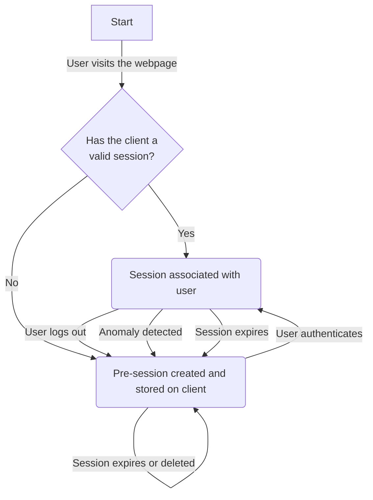

# Session management

:::warning
The following document is not yet implemented
:::

## Introduction
The session is one of the most important and sensitive pieces of information a user possesses. They enable a user to identify themselves, accessing their account without providing their full credentials with every request. Because of this, session management is one of the most significant parts of a web application that requires authentication. Insecure implementations endanger users, leading to account takeovers, theft of sensitive data or more. Fortunately, this web application is a standalone web application that handles not that sensitive data. Therefore, security flaws do not have a huge impact on users. But nonetheless, user privacy is also important and not everyone would be keen to know their car locations, friend or family group members, and other information was compromised and is now publicly available. Additionally, the web application has to handle email addresses and passwords to implement user account, and we can assume that some users might reuse a password from another website. Leakage of this information would be detrimental. Therefore, we paid great attention on implementing secure session management.

## Session types
There are two types of sessions: **Pre-sessions** and **sessions**. Each is used in a different stages of the authentication life-cycle.

### Pre-sessions
**Pre-sessions** are used to protect logins from *CSRF* attacks and are only used before user authentication. They are not associated with a specific user and only exist during the short duraction between a user visiting a site unauthenticated and the user authenticating. On a successfull login, they are immediately destroyed to prevent *session fixation* attacks. In return, the user receives a valid session associated with their account which is created independently from the pre-session.

### Sessions
**Session** are granted when a user successfully logs in and are associated with the user account. They are used to associate requests with a user, protect against *CSRF* attacks, and to detect login anomalies. 

## Session implementation
The server manages both types of sessions. Each session is identified by a *unique session ID* and has some *user data* and *client data* associated with it. What data is stored is explained in [Session data](#session-data). The data is used to protect the session against theft. This is further explained in [Detecting session anomalies](#detecting-session-anomalies).
The session ID has to be unique for all session, pre-session and sessions, to prevent collisions. A collision would happen if the server generates a session with a session ID that already exists. In the worst case, the receiver of that session ID would then accidentally get access to the session of another user with the same session ID.

A session has two types of expiration dates: *idle timeout* and *absolute timeout*, with the *idle timeout* being much smaller than the *absolute timeout*. This further explained in [Session expiration](#session-expiration).

Sessions are typically frequently accessed and written to, especially when features like *idle timeouts* are used. Therefore, fast read and write speeds are desirable. There are several types of database systems which would fit this requirements. The one we will use is [Redis](https://redis.io/), due to my prior experience using it. *Redis* is an open-source, in-memory data store typically used for caching, session storage, and other applications with real-time requirements.

### Session data
The following data is stored for a session.
 - Session ID
 - User ID
 - IP address
 - User-Agent
 - createdAt
 - lastUsedAt

Pre-sessions are missing the user associated attributes: *User ID*.

### Session life-cycles

## Session security
As mentioned before, session security is an essential part of protecting user account. Unfortunately, there exist many attacks that try to compromise sessions to gain unauthorized access to user accounts. We employ several security mechanism to protect session against potential attacks.

### Session expiration
As mentioned before, a session has two expiration dates.
Expiration dates are used to decrease the time a session ID is valid and can be used to access a user's account, thus, decreasing the time for an adversary to mount an attacking stealing a session ID.

The **idle timeout** is the time a session is valid without any user interaction.
For example, let's say the idle timeout is set to five minutes. 
If the user has not interacted with the session in five minutes, the session will be invalidated and destroyed, essentially, logging the user out.
This is useful to protect a session against hijacking, if a user is done using the website, but did not log out. Without this, the time window in which an attacker could steal a session ID is as large as the *absolute timeout*.

The **absolute timeout** defines the maximum amount of time a session is valid.
This time is independent from the *idle timeout* and takes precedence.
That means, if the absolute timeout is exceeded, the session is invalidated and destroyed even if the idle timeout has not run out.
This timeout is useful to prevent the time an attacker can use a hijacked session.

:::important
It is important that an attacker cannot change the credentials of an account without knowing them. Otherwise, the protection provided by the **absolute timeout** can be completely circumvented. An attacker could simply change the credential and completely take over the account. Therefore, it is required that any request to change the credentials has include the credentials and the server verifies them. For example, a request to change the password, has to include the current password.
:::

#### Timeout values
##### Session
The timeout values reflect the requirement that a user should be able to start driving their car and park it within the same login session.
Additionally, a user, using the app on a daily basis, should not have to log in every time they wish to use the website.
Therefore, the *idle timeout* and consequently *absolute timeout* are much larger that recommended.

**Idle timeout**: 12 hours 
**Absolute timeout**: 1 week

##### Pre-session
Because the primary purpose of the pre-session is to protect the authentication process and we expect the user to authenticate relatively quickly, the timeout value can be much shorter than for session.

**Idle timeout**: 5 minutes 
**Absolute timeout**: 1 hour

### Detecting session anomalies
Session hijacking is an attack in which an attacker somehow gets hold of a valid user session ID and uses it to send requests, impersonating the user.
With this, an attacker could completely takeover another user's account if session are not protected.

There exist several methods to detect such anomalies.
One method often used is to bind some characteristics of the client to the session when the session is created and verify on subsequent requests that the client still exhibits those characteristics.
While this method is not perfect, it decreases the risk of successful session hijacking because an attacker does not only have to get access to the session token but also to the bound client characteristics.
Nonetheless, a sophisticated attacker could be able to bypass this protection.

One important requirement for this system is that a user should be able to start driving their car and then park their car without getting logged out due to a detected anomaly.
Therefore, we have to bind client characteristics we don't expect to change after some time and at another location and should identify the client.

An optimal approach would be to use a certificate based approach and such an implementation is planned, but for now we will use the client's *User-Agent*.
On session creation, the client's *User-Agent* is bound to the session and on each request, using the session, it is checked if the client's *User-Agent* matches the bound one.

While it is important to detect session anomalies, an anomaly doesn't have to be of malicious nature.
For example, when the user updates their browser, the *User-Agent* typically reflects the newer browser version number, but the browser will still hold the session token.
Thus, the bound User-Agent will differ from the client's new User-Agent and the server will detect an anomaly.
Therefore, we shouldn't handle every anomaly as if it were an attack.

#### Reacting to an anomaly
If the server detects a session anomaly, we can expect that it is either an attack, or the client's User-Agent has changed.
Fortunately, we can assume that session tokens stay on the same device/client and that each device/client has a unique session token.
Therefore, if the client's User-Agent changes, the client will not be able to use the session token because it is bound to a different User-Agent.
With this assumption, the server simply invalidates the session token and deletes the session.

This servers two purposes. First, the user is forced to log in again, creating a new session for the new User-Agent.
Second, any brute-force attempt trying to guess the User-Agent and bypassing our anomaly detection is immediately prevented, if the attacker doesn't know the User-Agent.

:::warning
An XSS attack could be used to completely bypass this protection.
With an XSS attack an attacker can easily retrieve the User-Agent from the victim.
:::